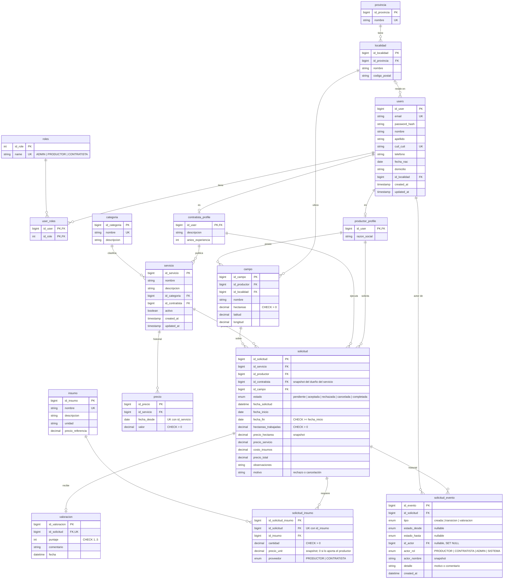
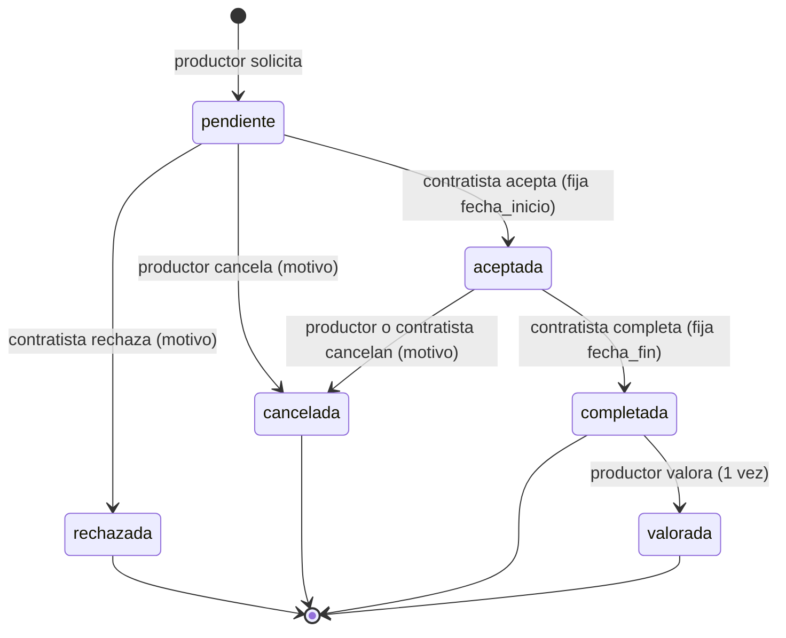

# Modelo de dominio

## Glosario

| Término | Significado en AgroApp |
|:-|:-|
| **Productor** | Usuario dueño de uno o más **campos** que solicita servicios rurales. Rol `PRODUCTOR`. |
| **Contratista** | Usuario que publica **servicios** (con precio por hectárea) y ejecuta los trabajos. Rol `CONTRATISTA`. Un usuario es productor **o** contratista, nunca ambos. |
| **Administrador** | Rol `ADMIN` que gestiona usuarios y catálogos. Puede combinarse con un rol de negocio. |
| **Campo** | Lote de un productor: nombre, localidad, hectáreas y, opcionalmente, coordenadas. |
| **Servicio** | Trabajo que ofrece un contratista dentro de una **categoría** (siembra, cosecha, pulverización…). Tiene baja lógica (`activo`). |
| **Precio** | Historial de precios por hectárea de un servicio. El **vigente** es el de mayor `fecha_desde` no futura. |
| **Insumo** | Ítem del catálogo (semilla, agroquímico, combustible) con **precio de referencia** que fija el administrador. |
| **Solicitud** | Pedido de un productor a un contratista por un servicio sobre un campo. Snapshotea el precio por hectárea y los importes del momento. |
| **Valoración** | Puntaje 1–5 y comentario que deja el productor sobre una solicitud completada. Una por solicitud. |

## Diagrama entidad-relación

Fuente de verdad: [`packages/database/prisma/schema.prisma`](../packages/database/prisma/schema.prisma). Las restricciones `CHECK` están en la migración `0001_init`. El DER original de la propuesta (abril 2025) se conserva en [img/MODELODEDATOS.png](img/MODELODEDATOS.png) a modo de historia.

## Reglas de negocio

### Roles y acceso
- Registro público solo como productor o contratista. `ADMIN` lo asigna otro administrador.
- Productor y contratista son excluyentes. No se puede quitar un rol de negocio si el usuario tiene campos, servicios o solicitudes asociadas; no se puede quitar el rol `ADMIN` al único administrador ni eliminarlo.
- Los roles se leen de la base en cada request (el JWT solo identifica al usuario), así que quitar un rol tiene efecto inmediato.
- Email, teléfono y domicilio son privados: solo se muestran a la contraparte de una solicitud. Los listados públicos muestran nombre y localidad.

### Servicios y precios
- Un servicio pertenece al contratista que lo publicó y no cambia de dueño.
- Se da de baja lógicamente (`activo = false`): deja de aparecer en el catálogo y no se puede solicitar, pero conserva su historial.
- El precio vigente es el de mayor `fecha_desde` no futura. Se pueden programar precios a futuro. No se puede eliminar el único precio vigente de un servicio activo.

### Campos
- Todo campo tiene nombre, localidad y hectáreas; las coordenadas son opcionales y se validan.
- No se puede reducir la superficie por debajo de la mayor superficie comprometida en solicitudes pendientes o aceptadas.
- No se puede eliminar un campo con solicitudes.

### Solicitudes
- La crea un productor sobre un campo propio; el contratista es el dueño del servicio en ese momento (snapshot).
- Las hectáreas a trabajar no pueden superar las del campo.
- Importes fijados al crear: `precio_servicio = precio vigente × hectáreas`; `costo_insumos = Σ cantidad × precio de referencia` solo de los insumos que aporta el contratista (los que aporta el productor no se cobran); `precio_total` es la suma. Un mismo insumo no se repite en una solicitud.
- Ciclo de vida:

- Las fechas son coherentes (`fecha_fin >= fecha_inicio`). El borrado físico de solicitudes es exclusivo de administración.

### Historial de la solicitud
- Cada alta, cambio de estado y valoración escribe una fila en `solicitud_evento` **dentro de la misma transacción** que el cambio que la origina: no puede existir una transición sin su registro.
- La tabla es de solo agregado. Guarda el estado de origen y destino, quién lo hizo, con qué rol y con qué motivo, más el nombre del actor congelado al momento del evento, de modo que el historial sobreviva al borrado del usuario.
- El rol `SISTEMA` queda reservado para lo que dispare el propio backend. Hoy lo usan las solicitudes anteriores a esta tabla, reconstruidas con `pnpm --filter server db:backfill-eventos`, cuyas fechas son aproximadas y se muestran como tales.
- El detalle de la solicitud devuelve el historial embebido en `solicitud_evento[]`, en orden cronológico.

### Cercanía
- `GET /contratistas?id_campo=` filtra por la localidad del campo; si no hay contratistas ahí, amplía a la provincia e informa el alcance aplicado.

## Decisiones de diseño y limitaciones conocidas

| Tema | Decisión |
|:-|:-|
| Unidad de precio | Todos los servicios se cotizan **por hectárea**. Servicios por hora o por viaje quedan fuera del alcance. |
| Precio de insumos | Lo fija el administrador como referencia; el contratista no negocia precio por solicitud. Simplifica el modelo y evita que el cliente fije precios ajenos. |
| Cercanía | Se resuelve por localidad y provincia del campo. No hay cálculo de distancia por coordenadas. |
| Disponibilidad | No hay calendario ni control de capacidad: un contratista puede aceptar trabajos superpuestos. |
| Confirmación del trabajo | La completitud la declara el contratista; el productor responde con la valoración. No hay disputas ni pagos en la plataforma. |
| Notificaciones | No hay email ni push; cada parte consulta su panel. |
| Eliminación de datos | Servicios y solicitudes no se borran (baja lógica y estados finales) para conservar el historial. Solo el administrador puede borrar solicitudes. |
