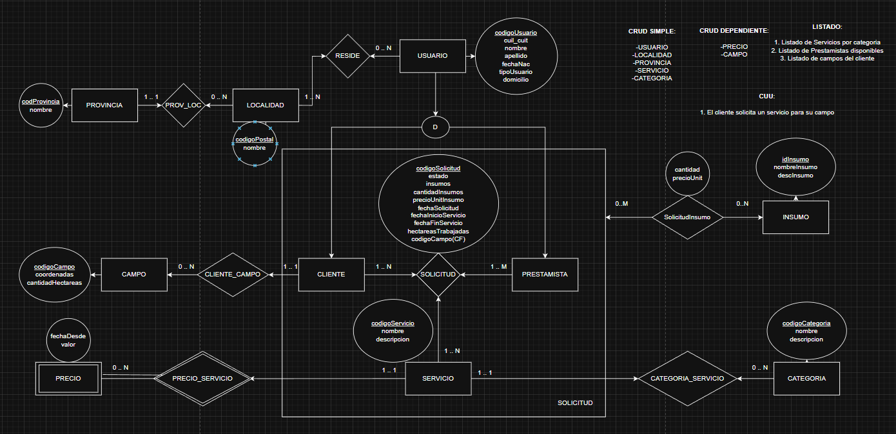

# Propuesta TP DSW — AgroApp

## Grupo
### Integrantes
* 53112 - Costantini, Jeremías
* 52911 - Messina, Tiziano Leonel

### Repositorios
* [fullstack app (monorepo)](https://github.com/JereC4/TP-DSW-2025-3k03-Messina-Costantini-Enrico)
* Pull requests: ver [docs/pull-requests.md](docs/pull-requests.md)
* Documentación: [docs/README.md](docs/README.md)
* Deploy: https://agroapp.dev · API: https://api.agroapp.dev · Swagger: https://api.agroapp.dev/docs

## Tema
### Descripción
El sistema conecta a productores agropecuarios (**clientes**) con contratistas que ofrecen servicios rurales (**prestamistas**): siembra, cosecha, fumigación, fertilización y otros trabajos de campo. Cada usuario se registra como cliente o prestamista. El prestamista publica sus servicios dentro de una categoría y les fija un precio por hectárea con historial. El cliente registra sus campos, busca servicios y prestamistas por categoría y por cercanía (provincia/localidad), y solicita un servicio indicando el campo, las hectáreas a trabajar y los insumos necesarios; el sistema calcula el importe. El prestamista acepta, rechaza y completa cada solicitud.

### Modelo

Stack (informado y aprobado en la propuesta original): monorepo pnpm + Turborepo; backend Node + Express + TypeScript + Prisma + MySQL; frontend React + Vite + TypeScript + Tailwind; autenticación JWT propia con roles ADMIN / CLIENTE / PRESTAMISTA.

## Alcance Funcional

### Alcance Mínimo

Regularidad (aprobada):
|Req|Detalle|
|:-|:-|
|CRUD simple|1. CRUD Categoría de servicio 2. CRUD Localidad 3. CRUD Usuario|
|CRUD dependiente|1. CRUD Servicio {depende de} Categoría y Prestamista 2. CRUD Solicitud {depende de} Servicio, Campo, Cliente y Prestamista 3. CRUD Campo {depende de} Cliente|
|Listado + detalle|1. Listado de servicios filtrado por categoría (y texto) → detalle con categoría, prestamista e historial de precios 2. Listado de prestamistas filtrado por provincia y localidad del cliente → detalle con datos de contacto y sus servicios con precio 3. Listado de campos del cliente → detalle del campo con sus solicitudes 4. Listado de solicitudes (historial) filtrado por estado → detalle completo: servicio, categoría, campo, cliente, prestamista, insumos e importes|
|CUU/Epic|1. Publicar un servicio 2. Solicitar un servicio publicado|

Adicionales para Aprobación:
|Req|Detalle|
|:-|:-|
|CRUD|1. Categoría de servicio 2. Servicio 3. Localidad 4. Provincia 5. Solicitud 6. Prestamista 7. Cliente 8. Campo 9. Insumo 10. Precio 11. Usuario (con roles)|
|CUU/Epic|1. Publicar un servicio (prestamista, con precio inicial) 2. Solicitar un servicio publicado (cliente: campo propio, hectáreas, insumos; precio = precio vigente × hectáreas + insumos) 3. Gestionar la solicitud: aceptar / rechazar / completar (prestamista) con transiciones validadas Los tres CUU están encadenados: cada uno usa los datos registrados por el anterior.|
|Login y niveles de acceso|Autenticación propia con JWT. Tres niveles: ADMIN (catálogos y usuarios), CLIENTE (campos y solicitudes propias), PRESTAMISTA (servicios, precios y solicitudes recibidas). Rutas protegidas en backend y frontend.|
|Tests|Backend: 2 unitarios (uno por integrante) + 1 de integración. Frontend: tests de componente + 1 e2e con Playwright.|

Nota sobre el listado "por aproximación geográfica" de la propuesta original: se implementó como filtro por provincia y localidad del prestamista, con la localidad del cliente logueado preseleccionada, dado que el modelo no almacena coordenadas de los usuarios (sí de los campos).

### Alcance Adicional Voluntario

|Req|Detalle|Estado|
|:-|:-|:-|
|CUU/Epic|1. Valoración del servicio: el cliente puntúa y comenta una solicitud completada; el promedio se muestra en el detalle del servicio y del prestamista|En desarrollo (Jeremías)|
|CUU/Epic|2. Cancelación de solicitud por el cliente mientras está pendiente|Implementado|
|Otros|1. Documentación OpenAPI/Swagger generada desde los schemas de validación 2. CI en GitHub Actions con tests en cada PR 3. Envío de email al cambiar el estado de la solicitud|1 y 2 implementados; 3 no se realizará|
